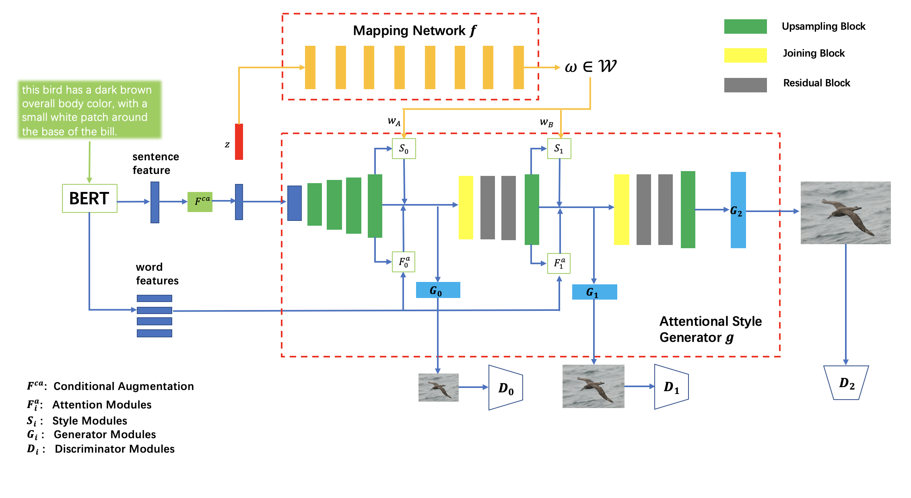

# SBA-GAN

[proposal](./docs/proposal.pdf)

[milestone](./docs/milestone.pdf)

[report](./docs/report.pdf)

### Data
- Download metadata [birds.zip](https://drive.google.com/file/d/1O_LtUP9sch09QH3s_EBAgLEctBQ5JBSJ/view?usp=sharing) and unzip it into `AttnGAN2/data/`
- Download the [birds](http://www.vision.caltech.edu/visipedia/CUB-200-2011.html) dataset and save it in `AttnGAN2/data/birds/`

### Pretrained Model
- [DAMSM Baseline](https://drive.google.com/file/d/1J4nwRNkIRINYb38Bw3YfS6RLAyqyJiVB/view?usp=sharing): Download and save it to `AttnGAN2/DAMSMencoders/`
- [DAMSM BERT](https://drive.google.com/file/d/1xXobeJHCsCnanaMQwzoHzIjURtDl6N75/view?usp=sharing): Download and save it to `AttnGAN2/DAMSMencoders/`
- [Model Baseline](https://drive.google.com/file/d/1MotDo_aqCK_ZWV7HrzBuvxOrJcB3Z8Ll/view?usp=sharing): Download and save it to `AttnGAN2/models/`
- [Model BERT](https://drive.google.com/file/d/1ksoJ53g76BPfymTMbLwx3S040whL2YhL/view?usp=sharing): Download and save it to `AttnGAN2/models/`
- [Model Style Mixing](https://drive.google.com/file/d/1f6hXwOjeGZpYRvANAkhUEWcMVQqLBM36/view?usp=sharing): Download and save it to `AttnGAN2/models/`

### Training
- Pretrain DAMSM baseline model: `python pretrain_DAMSM.py --cfg cfg/DAMSM/bird.yml --gpu 0`
- Pretrain DAMSM BERT model: `python pretrain_DAMSM_bert.py --cfg cfg/DAMSM/bird.yml --gpu 0`
- Train baseline model: `python main.py --cfg cfg/bird_style.yml --gpu 0`
- Train BERT model: `python main_bert.py --cfg cfg/bird_style.yml --gpu 0`

### Sampling
- Run `python main_bert.py --cfg cfg/eval_bird.yml --gpu 0` to generate examples from captions in files listed in "AttnGAN2/data/birds/example_filenames.txt".
- Input your own sentence in "AttnGAN2/data/birds/example_captions.txt" if you wannt to generate images from customized sentences.